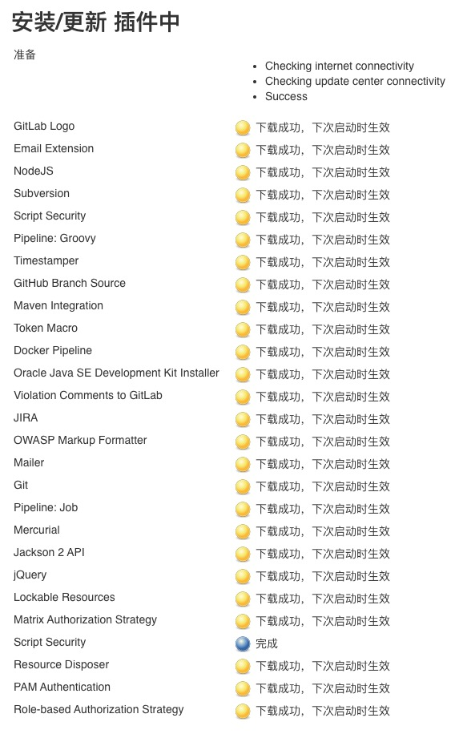
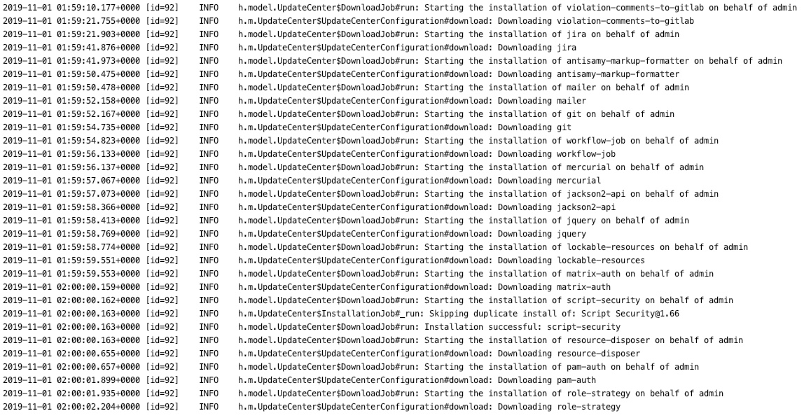

#使用文档
1. 修改/etc/hosts将更新插件域名代理到本机
```127.0.0.1 updates.jenkins-ci.org```
2. 下载代码
`git clone https://github.com/g1335333249/jenkins-china-mirrors-convert.git`
3. 执行 ```script/start.sh```
4. 设置`nginx`代理到代码服务
```   
server {
         listen 80;
         server_name updates.jenkins-ci.org;
         location / {
                 add_header Content-Type "application/octet-stream";
                 proxy_pass http://127.0.0.1:11302; 
                 proxy_set_header Host  $host;
                 proxy_set_header X-Real-IP $remote_addr;
                 proxy_set_header X-Forwarded-For $proxy_add_x_forwarded_for;
         }
    }
```
5. 完成，可以看到效果图

